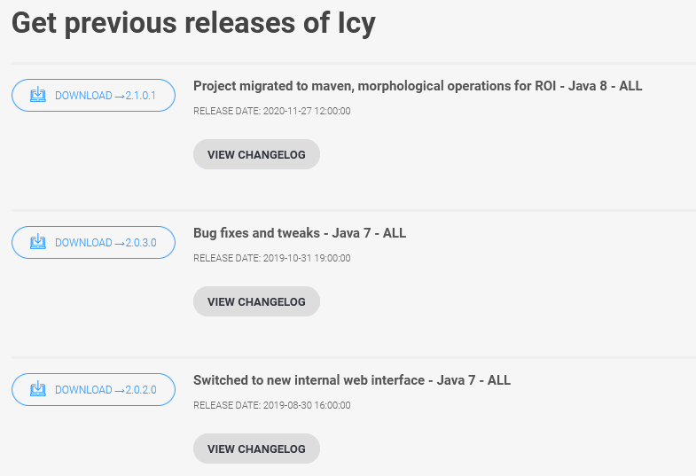
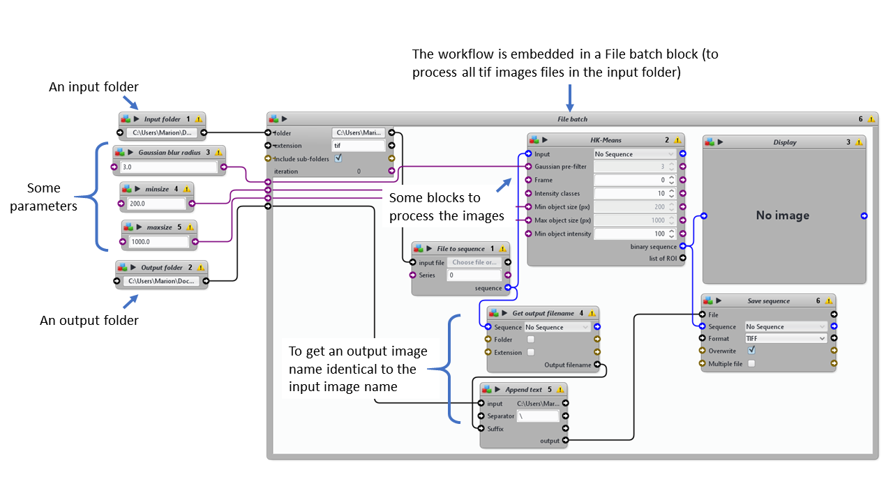
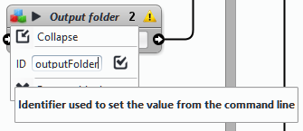

# Nuclei segmentation using HK-Means - Icy

Example of segmentation workflow using HK-Means for [Biaflows](https://biaflows.neubias.org/#/). Biaflows is an online benchmarking platform allowing the comparison of several sets of parameters for one workflow and/or the comparison of several workflows on reference datasets.         

## How to run an Icy protocol on Biaflows      

For the moment, you can get started with Biaflows using the [Biaflows sandbox](https://biaflows-sandbox.neubias.org/#/). This is the perfect space to get familiar with Biaflows and make tests. The main Biaflow server is dedicated to curated workflows and datasets. This document explains [how to contribute to Biaflows](https://neubias-wg5.github.io/contribute.html). Later on, you might want to install your own Biaflows server.      

There is a [full online documentation on how to use Biaflows](https://neubias-wg5.github.io/). The lines below detail the specifities for an Icy workflow.       

Biaflows takes workflows encapsulated in Docker containers. In the case of Icy workflows, the Docker container contains
- a Dockerfile specifying notably the version of Icy to use        
- a protocol (the actual workflow)          
- a descriptor.json file to specify the name of the workflow and its parameter    
- a wrapper.py file to run the container on the Biaflows server     


## Change the Icy version in the Dockerfile

This part of the Dockerfile installs Icy, adds Icy to the PATH of the container and adds a protocol folder.     

```
# ---------------------------------------------------------------------------------------------------------------------
# Install Icy.
RUN apt-get update && apt-get install -y unzip wget && \
    mkdir -p /icy && \
    cd /icy && \
    wget -O icy.zip http://icy.bioimageanalysis.org/download-file/?id=79911 && \
    unzip icy.zip && \
    rm -rf icy.zip

# Add icy to the PATH
ENV PATH $PATH:/icy

RUN mkdir -p /icy/data/in && \
        mkdir -p /icy/protocols

RUN chmod -R a+rwx /icy 
```

To change the version of Icy: 

Go at the bottom of [the download page of the Icy website](http://icy.bioimageanalysis.org/download/), in the "Get previous releases of Icy" section.
Copy the download link of the version of Icy of your choice.

Replace the following link ```http://icy.bioimageanalysis.org/download-file/?id=79911``` by the one you just copied.





## Change the protocol name


By default, if you fork this repository, the name of the protocol will be "Icy_protocol.protocol". You are free to use another name, but you will need to replace "Icy_protocol.protocol" by the name of your choice in the following lines in the following files:
- in the Dockerfile, in the Install Protocol section        

```
# ---------------------------------------------------------------------------------------------------------------------
# Install Protocol
ADD Icy_protocol.protocol /icy/protocols/Icy_protocol.protocol
ADD wrapper.py /app/wrapper.py
```
- in the wrapper.py, in the execution command        

```python
# 3. Execute workflow
        gaussradius = nj.parameters.radius
        nj.job.update(progress=25, statusComment="Launching workflow...")
        call("java -cp /icy/lib/ -jar /icy/icy.jar -hl", shell=True, cwd="/icy")
        call("java -cp /icy/lib/ -jar /icy/icy.jar -hl -x plugins.adufour.protocols.Protocols "
             "protocol=\"/icy/protocols/Icy_protocol.protocol\" inputFolder=\"{}\" outputFolder=\"{}\" extension=tif radius=\"{}\"".format(in_path, out_path, gaussradius), shell=True, cwd="/icy")

```

## Protocol specifications: input and output folder and variable names     



The workflow must process an input image folder, with images in .tiff and output results images also in .tiff, **same name as the input images**, in a second folder. To do so in Icy, embed the workflow in a *File Batch block* and add two *Folder blocks*, one for the input folder, and another for the output folder. For each folder block, an ID must be defined. For instance "inputFolder" for the input folder. This ID will be called by the wrapper.py when executing the workflow. The name of the block does not matter. 

In the wrapper.py

```python
# 3. Execute workflow
        gaussradius = nj.parameters.radius
        nj.job.update(progress=25, statusComment="Launching workflow...")
        call("java -cp /icy/lib/ -jar /icy/icy.jar -hl", shell=True, cwd="/icy")
        call("java -cp /icy/lib/ -jar /icy/icy.jar -hl -x plugins.adufour.protocols.Protocols "
             "protocol=\"/icy/protocols/Icy_protocol.protocol\" inputFolder=\"{}\" outputFolder=\"{}\" extension=tif radius=\"{}\"".format(in_path, out_path, gaussradius), shell=True, cwd="/icy")

```

the command ```inputFolder=\"{}\"``` should match the ID name.   

**The output image name must be the same as the input image name**. Here we create the output file path by getting the name of the image with the block *Get output filename* and concatenating it with the path of the output folder using the block *Append text*.  

To add the possibility to modify some workflow parameters, add *Integer blocks* outside the *File Batch block* and connect them to the corresponding parameter. For each Integer block, an ID must be defined. Here also, the name of the block does not matter. In the example, the block Gaussian blur radius (custom name of an Integer block) has the ID "radius".



The ID of the parameter must be specified in the wrapper.py:

```python
# 3. Execute workflow
        gaussradius = nj.parameters.radius
        nj.job.update(progress=25, statusComment="Launching workflow...")
        call("java -cp /icy/lib/ -jar /icy/icy.jar -hl", shell=True, cwd="/icy")
        call("java -cp /icy/lib/ -jar /icy/icy.jar -hl -x plugins.adufour.protocols.Protocols "
             "protocol=\"/icy/protocols/Icy_protocol.protocol\" inputFolder=\"{}\" outputFolder=\"{}\" extension=tif radius=\"{}\"".format(in_path, out_path, gaussradius), shell=True, cwd="/icy")

```

As the value of the parameter can be modified directly on Biaflows when running the workflow, it needs to be added also to the descriptor.json file
```json
        {
            "id": "radius",
            "value-key": "@ID",
            "command-line-flag": "--@id",
            "name": "radius",
            "description": "Gaussian blur radius",
            "type": "Number",
            "default-value": 3,
            "optional": true
        }
```

## Docker commands

### To build the container           
We will name the container "icyseg".
*In Windows command prompt*          
The installation of [Docker Desktop](https://www.docker.com/products/docker-desktop) is recommended to manage images and containers.         
 
```bash
cd path-to-the-folder-containing-the-Dockerfile-wrapper.py-and-.protocol-file
docker build -t icyseg .
```

*In Linux shell*            

```bash
sudo docker build -t icyseg .
```

## To run an image        

To test if the workflow is running "locally". This avoids having to make a new version of the workflow (which triggers a new build on DockerHub, which triggers a new test of the workflow on the Biaflows Sandbox server).                
Get public XXXXXXXXX and private YYYYYYYYYY keys from the Biaflows sandbox server: menu up right -> Account            
software_id and project_id must match the values given to the existing workflow on Biaflows and the problem (here "Nuclei-segmentation").        
- To find the project_id, go to Problems, click on the problem (here "Nuclei-segmentation") related to your workflow, look at the address of the website (here: "https://biaflows-sandbox.neubias.org/#/project/205081/images") and take the number after "project/" (here: "205081").      
- To find the software_id, go to Workflows, search for your workflow and click on it. Look at the address (here: "https://biaflows-sandbox.neubias.org/#/software/1669677" for ML-i2k-IcyNucleiSeg (v0.0.5)) and take the number after "software/" (here: "1669677").          

Give values to all input parameters (here "radius").           

*In Windows command prompt* 
```bash
docker run -it icyseg --host https://biaflows-sandbox.neubias.org --public_key XXXXXXXXX --private_key YYYYYYYYYY --software_id 1669677 --project_id 205081 --radius 3
```

*In Linux shell*
```bash
sudo docker run -it icyseg --host https://biaflows-sandbox.neubias.org --public_key XXXXXXXXX --private_key YYYYYYYYYY --software_id 1669677 --project_id 205081 --radius 3
```


